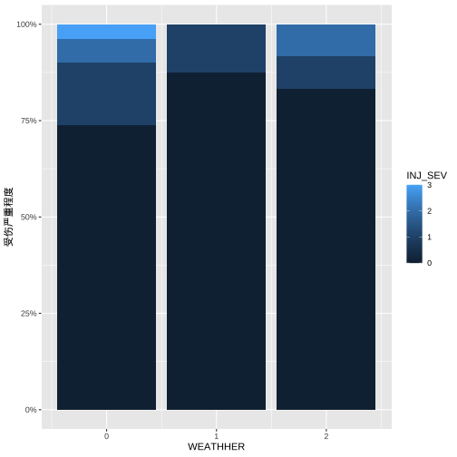

## 1.导入数据

```r
library(tidyverse)
dfdemo <- read_csv("/Users/cpf/Documents/paper/R_programming/Rprocess/mydata/dfdemo.csv")
head(dfdemo)
```

```
## # A tibble: 6 x 8
##        CASENUM WEATHHER  VENO   AGE  AGE1   SEX REST_USE INJ_SEV
##          <dbl>    <dbl> <dbl> <dbl> <dbl> <dbl>    <dbl>   <dbl>
## 1 201700316865        0     1    49     2     1        1       0
## 2 201700316865        0     2    16     0     1        1       0
## 3 201600777740        0     1    18     0     1        1       1
## 4 201600777740        0     2    38     1     0        1       1
## 5 201801320571        2     1    71     3     1        1       0
## 6 201801320571        2     2    64     3     1        1       2
```

```r
# 根据天气和事故严重程度做分组计数
group = dfdemo %>% 
  count(WEATHHER, INJ_SEV)
group
```

```
## # A tibble: 9 x 3
##   WEATHHER INJ_SEV     n
##      <dbl>   <dbl> <int>
## 1        0       0    59
## 2        0       1    13
## 3        0       2     5
## 4        0       3     3
## 5        1       0     7
## 6        1       1     1
## 7        2       0    10
## 8        2       1     1
## 9        2       2     1
```
## 2. 用ggplot2画百分比柱状图

```r
## 添加字体
library(showtext)
## 为了使ggplot中有中文字体，可根据自己电脑里字体的位置自行添加。
font_add("kt", "/Users/cpf/Library/Fonts/楷体_GB2312.ttf") 
showtext_auto()
# stacked + percent
group %>% 
  drop_na() %>%  #去掉所有空值，避免出错
  ggplot(aes(fill=INJ_SEV, y= n, x = WEATHHER)) + 
  geom_bar(position="fill", stat = "identity") +
  scale_y_continuous(labels = scales::percent) + #纵坐标变为百分比
  labs(y = "受伤严重程度") +
  theme_gray()
```




